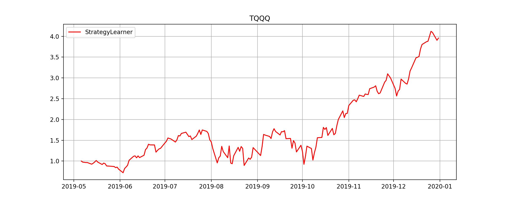

# Automated_Trading_Robinhood

> Machine Learning based Automated Trading with Robinhood app

The basic idea is to read historical data and compute indicators as our features for classification. The BUY and SELL signals are created based on the future peak of historical data. If the cumulative return of a stock after 3 days into the future is high enough, it is a BUY signal. If it is low, it is considered to be a SELL signal. If it is pretty much the same, we DO NOTHING. Basic sci-kit learn ML models are used. 

## Installation

OS X & Linux:

First, download the unofficial Robinhood API that lets you login and place market orders. See github repo for more information.

```sh
git clone https://github.com/LichAmnesia/Robinhood
cd Robinhood
sudo python3 setup.py install
```
Then, use pip to install the required Python libraries below:
datetime, pandas, numpy, matplotlib,yfinance, yahoofinancials, sklearn

## Robinhood Login 
Robinhood is now requiring a mandatory MFA.

Going to your Robinhood Web App and turning on 2FA is highly recommended because without it your auth tokens will expire every 24 hours. To do this, go to settings, turn on 2FA, select "Authentication App", click "Can't Scan It?", and save the 16-character QR code.

For now, only Python 3 code will work with this.

Use something like this to login:
```
QR = "1234567899qwertd"
my_trader = Robinhood()
my_trader.login(username="username", password="p@ssw0rd", qr_code=QR)
```

## Market Simulation
To make sure your classifier works, run the following: 
```
python3 simulate_results.py
```
You can change the number of shares to buy/sell, ML algorithm, and starting value of your portfolio. This script simulates the market from previos years with your trading decisions and shows the performance of your portfolio. 

## Automated Trading
After simulating your trading strategy, run the following Python script: 
```
python3 automated_trading.py
```
Make sure you login to Robinhood correctly. You can use crontab to execute the script daily. 

One important thing with this is the .txt files. You need to manually create txt files for each stock you own or want to own. Just enter the number of shares you currently have or 0. Examples are provided in the repo. This helps with automating, as the files get updated each time you buy or sell any shares. This would make sure Robinhood will not try to sell any shares you do not have. 

## Example Simulation
The performance of our classifier with TQQQ stock is shown below. Note that the portfolio values are normalized.

